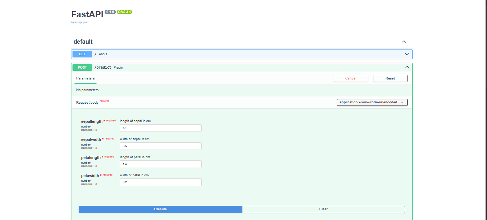

## APP


## UI

# 🌸 Flower Species Prediction API (ANN + FastAPI)

This project is a machine learning-powered API built with **FastAPI** that predicts the **species of a flower** based on its features. It uses an **Artificial Neural Network (ANN)** trained on the Iris dataset to classify the flower into one of three species.

---

## 🚀 Features

- 🔢 Predicts flower species from 4 input features:
  - Sepal Length
  - Sepal Width
  - Petal Length
  - Petal Width
- 🧠 Powered by an ANN model built with TensorFlow/Keras
- 📦 Exposes endpoints using **FastAPI**
- 📝 Auto-generated API docs (`/docs`)
- 🔄 Includes `POST`, `PUT`, and `DELETE` endpoints to simulate create/update/delete operations

---

## 🧠 Technologies Used

- Python
- FastAPI
- TensorFlow / Keras
- NumPy
- Scikit-learn (for scaling & label encoding)
- Joblib (to save/load model and preprocessing tools)

---

## 📁 Project Structure
├── app.py # FastAPI app with POST/PUT/DELETE routes

├── model.pkl # Trained ANN model

├── scaler.pkl # StandardScaler for input features

├── encoder.pkl # LabelEncoder for output classes

├── requirements.txt # Required libraries

└── README.md # Project documentation


---

## 📦 How to Run Locally with Conda

1. **Clone the repository**  
   ```bash
   git clone https://github.com/CodewithAvijit/FLOWER_SPECIES_CLASSIFICATION-USING-TENSORFLOW-.git
   cd FLOWER_SPECIES_CLASSIFICATION-USING-TENSORFLOW-
2.**Update**

  ```bash
conda env create -f environment.yml
conda activate flower-env  # or the environment name defined in the file
  ```
3.**Run the FastAPI server**
```bash
uvicorn app:app --reload
Test the API in your browser

Swagger UI: http://127.0.0.1:8000/docs

ReDoc UI: http://127.0.0.1:8000/redoc
```
📌 Author
Avijit Bhadra